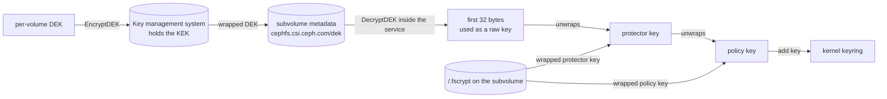
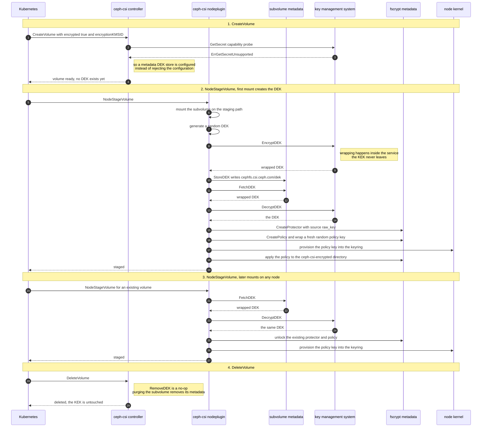
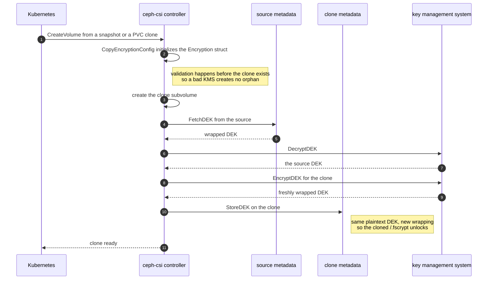

# A metadata DEK store for CephFS

## Problem description

CephFS file encryption works with six of the ten key management systems
Ceph-CSI supports. It fails on the other four, and always for the same
reason:

| Provider | Backend | DEK store | `GetSecret` | CephFS fscrypt |
| --- | --- | --- | --- | --- |
| `default` | Kubernetes Secret | integrated | not applicable | works |
| `vault` | HashiCorp Vault | integrated | not applicable | works |
| `vaulttokens` | Vault, tenant token | integrated | not applicable | works |
| `vaulttenantsa` | Vault, tenant SA | integrated | not applicable | works |
| `azure-kv` | Azure Key Vault | integrated | not applicable | works |
| `metadata` | Kubernetes Secret | metadata | supported | works |
| `kmip` | any KMIP server | metadata | unsupported | **fails** |
| `aws-metadata` | Amazon KMS | metadata | unsupported | **fails** |
| `aws-sts-metadata` | Amazon KMS via STS | metadata | unsupported | **fails** |
| `ibmkeyprotect` | IBM Key Protect | metadata | unsupported | **fails** |

The four that fail are the wrap and unwrap only services. They hold a key
encryption key (KEK) that can never be read out, and they expose no way to
store a per-volume data encryption key (DEK). They can only encrypt and
decrypt a DEK handed to them.

For RBD that is enough, because Ceph-CSI stores the wrapped DEK in the RBD
image metadata. For CephFS it is not, because **CephFS has no
`kms.DEKStore` implementation**, so there is nowhere to put the wrapped
DEK. `ConfigureEncryption` therefore falls back to asking the KMS for a
directly usable secret, and rejects the configuration when the KMS cannot
provide one:

```go
// internal/cephfs/store/volumeoptions.go
if errors.Is(err, util.ErrDEKStoreNeeded) {
    _, err := vo.Encryption.KMS.GetSecret(ctx, "")
    if errors.Is(err, kmsapi.ErrGetSecretUnsupported) {
        return err
    }
}
```

This document proposes implementing that missing DEK store on CephFS
subvolume and snapshot metadata, which fixes all four services at once —
Amazon KMS and IBM Key Protect under their existing providers, KMIP
under a new `kmip-metadata` provider — and is the only one of the three
candidate designs under which the key material never leaves the key
management system.

## Relationship to the two sibling designs

Two other designs address the same issue, both scoped to KMIP alone:

- [fscrypt encryption with a KMIP key management
  system](fscrypt-with-kmip.md) implements `GetSecret` on `kmipKMS` as a
  base64 copy of the managed key. About ten lines. Requires the KMIP
  `Get` operation, so the key material is exported to every node on
  every mount, and it cannot help Amazon KMS or IBM Key Protect, whose
  CMK is not exportable by design.
- [KMIP as an integrated DEK store](kmip-integrated-dek-store.md) makes
  KMIP store one object per volume. About 600 lines. It has no KEK at
  all: per-volume keys live in the appliance and are handed out on every
  mount. Its distinguishing capability is cryptographic erase of a single
  volume.

This design is the only one of the three where the long lived key stays
inside the key management system. `USE_CRYPTO_RPC` defaults to true for
KMIP, so wrapping and unwrapping happen inside the service unless an
administrator opts out, exactly as they always do for Amazon KMS and IBM
Key Protect, and Ceph-CSI only ever sees the per-volume DEK. That is the
same arrangement RBD block encryption has used for years.

The two KMIP designs coexist by provider name: the `GetSecret` design
owns the bare `kmip` provider, while this design registers
`kmip-metadata` (see *A dedicated provider for KMIP* below), so the
location of a volume's keys follows from the provider name instead of a
configuration value.

A comparison table is at the end of this document.

## Background

### How the metadata arrangement works for RBD

`RequiresDEKStore` declares which arrangement a provider needs.
`DEKStoreIntegrated` means the KMS stores the DEK itself and must
implement `kms.DEKStore`. `DEKStoreMetadata` means Ceph-CSI has to store
the wrapped DEK somewhere attached to the volume. For RBD that place is
the image metadata:

```go
// internal/rbd/encryption.go
metadataDEK = "rbd.csi.ceph.com/dek"

func (ri *rbdImage) StoreDEK(ctx context.Context, volumeID, dek string) error {
    ...
    return ri.SetMetadata(metadataDEK, dek)
}
```

The lifecycle is:

```text
provision  random DEK -> KMS.EncryptDEK -> wrapped blob -> StoreDEK
mount      FetchDEK -> wrapped blob -> KMS.DecryptDEK -> DEK -> LUKS open
```

`rbdImage.RemoveDEK` is deliberately a no-op, because the image is about
to be deleted along with its metadata.

### The CephFS storage primitives already exist

The missing piece is only the adapter. Both storage layers are already
implemented and in use:

| Layer | Ceph-CSI | Vendored go-ceph |
| --- | --- | --- |
| subvolume | `internal/cephfs/core/metadata.go` | `fsAdmin.SetMetadata`, `GetMetadata`, `RemoveMetadata` |
| snapshot | `internal/cephfs/core/snapshot_metadata.go` | `fsAdmin.SetSnapshotMetadata`, `GetSnapshotMetadata`, `RemoveSnapshotMetadata` |

Subvolume metadata already carries the cluster name, the client address,
the userID mapping and the ServiceAccount access restriction. Ceph-CSI
wraps set, remove and list for both layers; only the single key getters
are unwrapped, which is about fifteen lines each.

### The dot prefix convention

Keys prefixed with `.` are deliberately excluded from mirroring, as the
comments on `clientAddressKey`, `userIdMappingKey` and
`ServiceAccountKey` state. RBD had the identical convention and the
identical problem, resolved in commit `ec6703ed5`:

> RBD image metadata keys that start with '.rbd' are expected to be
> internal to RBD itself and are not mirrored to remote sites. Renaming
> the keys (dropping the '.' prefix) and using the new MigrateMetadata()
> function now makes the keys available on remote sites too.

A DEK that is not mirrored would make a mirrored subvolume unopenable at
the remote site. This design therefore uses an unprefixed key, and needs
no migration path because no such key exists yet on CephFS.

## Proposed change

### The metadata key

```go
// cephfsMetadataDEK is the key in the subvolume or snapshot metadata
// where the encrypted DEK is stored. It is intentionally not prefixed
// with a dot, so that it is mirrored along with the subvolume.
cephfsMetadataDEK = "cephfs.csi.ceph.com/dek"
```

The name mirrors `rbd.csi.ceph.com/dek` so that the two drivers stay
recognizably symmetric.

### Two DEK store adapters

`DEKStore` is keyed by a single string, and `CopyEncryptionConfig` uses it
for snapshots as well as volumes, so two small adapters are needed rather
than one:

```text
subVolumeDEKStore   wraps core.SubVolumeClient
    StoreDEK   -> setMetadata(cephfsMetadataDEK, dek)
    FetchDEK   -> getMetadata(cephfsMetadataDEK)
    RemoveDEK  -> no-op, the subvolume is being purged

snapshotDEKStore    wraps core.SnapshotClient
    StoreDEK   -> setSnapshotMetadata(cephfsMetadataDEK, dek)
    FetchDEK   -> getSnapshotMetadata(cephfsMetadataDEK)
    RemoveDEK  -> no-op, the snapshot is being removed
```

Each adapter asserts that the key it is given matches the volume or
snapshot it wraps, in the spirit of `rbdImage.StoreDEK`, so that a
mismatched call is a loud programming error rather than silent
corruption. The comparison can not be literal equality as it is for RBD,
because the DEK is keyed by the CSI volume ID while the adapter knows the
subvolume name; both end in the same ObjectUUID, so the last 36
characters are compared instead.

`ErrSubVolMetadataNotSupported` must be fatal here. Every current caller
degrades to nil when the Ceph cluster is too old to support subvolume
metadata, which is correct for optional bookkeeping and wrong for a DEK:
silently skipping the write would produce a volume that can never be
opened.

### One predicate instead of four branches

This is the part of the design that carries the compatibility risk, and
also the part that ends up simplifying the code.

`internal/util/fscrypt/fscrypt.go` makes four separate decisions from
`RequiresDEKStore()`: which passphrase source to use (`getPassphrase`,
line 80) and, all three inside `Unlock`, the key size (line 384), the
fscrypt source type (line 448) and whether to generate a new passphrase
(line 467). Existing CephFS volumes under the
`metadata` provider are `DEKStoreMetadata` *and* use
`SourceType_custom_passphrase`. If this design simply routed every
metadata provider through a DEK store, those volumes would stop opening.

The decision must therefore be made per provider rather than on store
type. And it must be an explicit property of the provider, not inferred
from what `GetSecret` answers: a provider that gains a `GetSecret`
implementation later — the sibling design does exactly that for `kmip` —
would otherwise silently reroute where the DEKs of new volumes live.
Each provider whose wrapped DEK belongs in the volume metadata therefore
opts in through a package-private marker, exposed as one predicate:

```go
// internal/kms/kms.go
func SupportsVolumeDEKStore(ekms EncryptionKMS) bool

// internal/cephfs/store/volumeoptions.go
if errors.Is(err, util.ErrDEKStoreNeeded) {
    if kmsapi.SupportsVolumeDEKStore(kms) {
        // the provider wraps and unwraps the DEK, and the wrapped
        // DEK is kept in the metadata of the subvolume itself
        vo.Encryption.SetDEKStore(newSubVolumeDEKStore(vo))

        return nil
    }
    // otherwise the pre-existing GetSecret capability probe runs
}
```

fscrypt then asks a single question, for which `VolumeEncryption` needs
one new accessor:

```go
// HasDEKStore returns true when a DEKStore is configured, either because
// the KMS is its own store or because the caller configured one.
func (ve *VolumeEncryption) HasDEKStore() bool {
    return ve.dekStore != nil
}
```

The integrated case falls out for free, because `NewVolumeEncryption`
already sets `dekStore` for integrated providers. All four branches
collapse into one:

```text
HasDEKStore()   source              passphrase comes from
true            raw_key             GetCryptoPassphrase, 32 bytes
false           custom_passphrase   GetSecret, length of the secret
```

Which yields exactly the behavior each provider needs:

| Providers | Store | Opted in | Source | Passphrase from |
| --- | --- | --- | --- | --- |
| `vault`, `azure-kv`, `default`, both Vault tenant variants | integrated | n/a | `raw_key` | the KMS |
| `metadata` | metadata | no | `custom_passphrase` | `GetSecret`, unchanged |
| `kmip-metadata`, `aws-metadata`, `aws-sts-metadata`, `ibmkeyprotect` | metadata | yes | `raw_key` | the new CephFS DEK store |

Existing volumes of the first two groups keep their current behavior bit
for bit, because their predicate value does not change.

### A dedicated provider for KMIP

Amazon KMS and IBM Key Protect opt in under their existing provider
names. Their keys can never be exported, so no other fscrypt arrangement
will ever exist for them and the bare name is unambiguous.

KMIP is different: its `Get` operation can export the managed key, and
the sibling design uses that to back fscrypt directly under the bare
`kmip` provider. Opting the bare name into the DEK store as well would
make one configuration value decide where the keys of new volumes live,
which is data loss by edit rather than a misconfiguration. This design
therefore registers a separate provider, following the pattern
`aws-sts-metadata` already uses next to `aws-metadata`:

- `kmip` stays as it is: block encryption wrap and unwrap, and whatever
  fscrypt arrangement the sibling design gives it.
- `kmip-metadata` shares the connection handling and the credentials
  Secret of `kmip`, opts into the volume DEK store, and never implements
  `GetSecret`: this provider does not export key material, under either
  `USE_CRYPTO_RPC` setting.

The choice between the two contracts is made once, visibly, per KMS
configuration section. There is no migration between them: a volume
provisioned under one provider can not be opened under the other,
because the key lives in a different place.

### The clone ordering problem

`CopyEncryptionConfig` currently runs *before* the clone exists:
`createBackingVolume` calls it at `controllerserver.go:94` and `:103`,
while `CreateCloneFromSnapshot` and `CreateCloneFromSubvolume` run at
`:146` and `:177`. A subvolume DEK store cannot write to a subvolume that
has not been created yet.

RBD does not rely on the clone inheriting the metadata. Its
`copyEncryptionConfig` fetches the plaintext passphrase from the source
and re-stores it, re-wrapped, for the clone. The clone must end up with
the *same* plaintext DEK, because its `/.fscrypt` metadata was wrapped
with the source's key.

The fix is to split the existing function rather than reorder the flow:

- The part that initializes a fresh `Encryption` struct and validates the
  KMS stays where it is, before the clone is created, so a
  misconfiguration still fails without leaving an orphaned clone behind.
  The passphrase copy for a KMS with an integrated DEK store also stays,
  so that arrangement keeps its exact current ordering and retry
  behavior.
- Only the new case moves: for a wrap and unwrap only KMS the DEK is
  written by a new `CopyEncryptionPassphrase` after `createBackingVolume`
  succeeds, next to the existing `SetAllMetadata` call whose comment
  already reads *"Set Metadata on PV Create"*. On failure the clone is
  purged, so a retry starts from scratch.

The snapshot path keeps its position, `doSnapshot` runs before the copy,
but not its shape: the current code passes a throwaway `VolumeOptions` as
the copy destination, which works for a KMS that is its own store and has
nowhere to put a metadata DEK. A dedicated
`CopySnapshotEncryptionPassphrase` re-wraps the DEK under the snapshot ID
into the snapshot metadata instead.

Restoring from a snapshot mirrors that: the source of the copy is the
snapshot metadata, keyed by the snapshot ID, not the metadata of the
parent subvolume. The copy selects the snapshot DEK store as the source
when a snapshot name is given.

Snapshot-backed volumes are the one shape that stays unsupported with a
wrap and unwrap only KMS: they have no subvolume of their own that could
hold the wrapped DEK, so `CopyEncryptionConfig` keeps rejecting that
combination.

### RBD file encryption

`configureFileEncryption` in `internal/rbd/encryption.go` performs the
same probe and configures no DEK store, so RBD with
`encryptionType: file` fails for the same four providers. Wiring
`SetDEKStore(ri)` there reuses the existing image metadata store and
fixes it with no new storage code, which keeps the two drivers
consistent.

### Implementation notes

Findings from a code review of the paths this design touches, recorded
here so the implementation does not rediscover them:

- **Guard the DEK store accessors.** `StoreCryptoPassphrase`
  (`internal/util/crypto.go:176`) and `GetCryptoPassphrase`
  (`crypto.go:201`) dereference `ve.dekStore` without a nil check,
  unlike `RemoveDEK` (`crypto.go:157`). Both need a guard returning
  `ErrDEKStoreNotFound`, so that a code path which misses the wiring
  fails with an error instead of a panic.
- **The adapter must resolve the subvolume lazily.** On the node path,
  `NewVolumeOptionsFromVolID` calls `InitKMS` at
  `internal/cephfs/store/volumeoptions.go:499`, before
  `SubVolume.VolID` is assigned at line 511. The adapter therefore
  holds the `*VolumeOptions` and builds its `core.SubVolumeClient` when
  `StoreDEK`/`FetchDEK` run, not when the store is configured.
- **The single key getters do not exist yet, but go-ceph has them.**
  Ceph-CSI wraps only set, remove and list; the vendored go-ceph
  provides `FSAdmin.GetMetadata` and `FSAdmin.GetSnapshotMetadata`, so
  each getter is a thin wrapper of about fifteen lines.
- **Do not copy the error swallowing.** `SetAllMetadata`
  (`internal/cephfs/core/metadata.go:139`) turns
  `ErrSubVolMetadataNotSupported` into nil. As the Risks section
  states, the DEK store must propagate it instead.
- **A latent bug sits next door, out of scope here.**
  `listSnapshotMetadata`
  (`internal/cephfs/core/snapshot_metadata.go:99`) calls
  `fsa.ListMetadata` on the parent subvolume instead of go-ceph's
  `ListSnapshotMetadata`, so it lists the wrong object's metadata. It
  deserves its own bug fix; the snapshot DEK store avoids it by using
  the new single key getter.
- **The journal needs no change.** `journal.ImageAttributes` already
  persists `KmsID` and `EncryptionType`, and the adapter derives
  everything else from the volume coordinates. Both reconstruction
  paths on the node — with a volume context
  (`volumeoptions.go:499`) and the journal-only fallback
  (`volumeoptions.go:518`) — funnel through `ConfigureEncryption`, so
  the store is wired in exactly one place.

## Key management



Three nested layers, and only the innermost one ever reaches the node:

1. The KEK stays in the key management system and wraps the DEK.
1. The wrapped DEK sits in the subvolume metadata next to the data.
1. fscrypt derives and wraps its own protector and policy keys in
   `/.fscrypt`, as it does for every other provider.

## Volume lifecycle

### Provisioning, mounting and deletion



Nothing has to be cleaned up in the key management system, and nothing can
be orphaned there, because the only per-volume state lives on the volume
and dies with it.

### Snapshots and clones



The clone must receive the same plaintext DEK, because the `/.fscrypt`
protector it inherited was wrapped with the source's key. Re-wrapping
rather than copying the blob keeps the behavior identical to RBD and
survives a future KEK rotation policy that rewraps per volume.

## What this buys

1. **The key material never leaves the key management system.** For KMIP
   with `USE_CRYPTO_RPC` at its default of true, and always for Amazon
   KMS and IBM Key Protect, wrapping and unwrapping happen inside the
   service. This is the property neither sibling design provides.
1. **All four broken providers are fixed by one change**, rather than
   KMIP alone. Amazon KMS and IBM Key Protect cannot be fixed any other
   way, because their CMK is not exportable.
1. **No new key management protocol code.** `EncryptDEK` and `DecryptDEK`
   are already implemented for all four providers and are used unchanged.
1. **No per-volume state outside the volume**, so nothing to garbage
   collect, no object quotas and no orphans.
1. **RBD `encryptionType: file` is fixed too**, by reusing the existing
   image metadata store.
1. **The code gets smaller in one place**: four `RequiresDEKStore`
   branches in `fscrypt.go` collapse into a single `HasDEKStore()`
   predicate.

What it does not provide is cryptographic erase of an individual volume.
All volumes under one KMS configuration share a KEK, so destroying it
shreds all of them. Only the integrated design offers per-volume erase.

## Risks

1. **Shared code blast radius.** This touches
   `internal/util/fscrypt/fscrypt.go` and `internal/util/crypto.go`,
   which serve every provider, rather than one provider file. The
   compatibility contract in *One predicate instead of four branches* is
   what keeps existing `metadata` and Vault volumes working, and it needs
   a test per row of that table.
1. **Ceph version dependency.** Subvolume and snapshot metadata must be
   supported by the Ceph cluster. Making
   `ErrSubVolMetadataNotSupported` fatal converts a silent data loss into
   a clear provisioning failure, but it does mean encrypted CephFS
   volumes require a new enough Ceph.
1. **A second wrapping layer.** [Ceph Filesystem fscrypt
   Support](cephfs-fscrypt.md) argues that "since fscrypt already stores
   wrapped keys there is no need for an extra layer of wrapping". That
   reasoning holds for a KMS that can hand out a usable secret. For a
   wrap and unwrap only service the extra layer is precisely what keeps
   the KEK inside the service, so the trade is deliberate rather than
   accidental.
1. **Clone ordering.** The split described above must keep validation
   before clone creation. Getting it wrong either creates orphaned clones
   on KMS failure, or writes a DEK to a subvolume that does not exist.
1. **Snapshot metadata support** is a separate capability from subvolume
   metadata in Ceph, with its own probe, so both have to be checked.

## Compatibility

- Volumes under the six providers that work today are unaffected. Their
  `HasDEKStore()` value is unchanged, so the fscrypt source type and the
  passphrase source are unchanged.
- No new options and no changes to the credentials Secrets. One new
  provider identifier, `kmip-metadata`, which reuses the configuration
  and the credentials Secret of `kmip` unchanged.
- The only behavioral change is that configurations which used to be
  rejected now succeed: `aws-metadata`, `aws-sts-metadata` and
  `ibmkeyprotect` under their existing names, KMIP under the new
  `kmip-metadata` provider. The bare `kmip` provider is untouched.
- There is no migration between `kmip` and `kmip-metadata`. Switching
  the provider of a KMS section that already has volumes makes them
  unopenable, because the key lives in a different place.
- A volume created by a newer release cannot be staged by an older one,
  which had no DEK store to read.
- The new metadata key is unprefixed from the start, so unlike RBD there
  is no `MigrateMetadata` path to carry.

## Delivery as a stacked series

The change splits into four pull requests, each independently
reviewable and revertable. The first is a pure refactor; the second is
the smallest change that fixes the four providers; the rest widen the
coverage.

1. **`util: decide fscrypt behavior on the DEK store, not the store
   type`** — the base, with no user visible change:
   - the `HasDEKStore()` accessor on `VolumeEncryption`,
   - nil guards in `StoreCryptoPassphrase` and `GetCryptoPassphrase`,
   - the four `RequiresDEKStore()` branches in
     `internal/util/fscrypt/fscrypt.go` replaced by the predicate,
   - one unit test per row of the provider table, as the regression
     guard for existing `metadata` and Vault volumes.

   The four providers are still rejected at `ConfigureEncryption`, so
   this PR changes behavior for nobody.
1. **`cephfs: store the wrapped DEK in the subvolume metadata`** —
   stacked on the first, fixes provisioning, mounting and deletion:
   - the `getMetadata` wrapper in `internal/cephfs/core/metadata.go`,
   - the `subVolumeDEKStore` adapter,
   - `ConfigureEncryption` configures the store instead of rejecting
     the KMS.

   `CopyEncryptionConfig` keeps its rejection, so snapshots and clones
   of volumes under the four providers still fail, now with that as
   the only remaining limitation. This document lands with this PR.
1. **`cephfs: support snapshots and clones of DEK-store volumes`** —
   stacked on the second:
   - the `getSnapshotMetadata` wrapper and the `snapshotDEKStore`
     adapter,
   - the `CopyEncryptionConfig` split described in *The clone ordering
     problem*,
   - the rejection in `CopyEncryptionConfig` removed.
1. **`rbd: configure the image DEK store for file encryption`** —
   stacked on the first only, independent of the CephFS pair:
   - `SetDEKStore(ri)` in `configureFileEncryption` and in the file
     encryption branch of `copyEncryptionConfig`, reusing the existing
     `rbdImage` metadata store.

A small standalone fix for the `listSnapshotMetadata` bug noted under
*Implementation notes* can go in parallel, outside the stack.

## Testing

Unit tests:

1. One case per row of the provider table, asserting the resulting
   fscrypt source type and passphrase source. This is the regression
   guard for existing `metadata` and Vault volumes.
1. `subVolumeDEKStore` and `snapshotDEKStore` round trips against a fake
   metadata client, including the volume ID mismatch assertion.
1. `ErrSubVolMetadataNotSupported` propagates as an error rather than
   being swallowed.
1. `HasDEKStore()` is true for integrated providers, true for metadata
   providers once a store is configured, and false for `metadata`.

End to end tests are more valuable here than for either sibling design,
because `aws-metadata` and the `metadata` provider are both exercisable
without a KMIP appliance. The existing CephFS encryption tests in
`e2e/cephfs.go` cover `secrets-metadata-test` and `vault-test`; adding a
clone and snapshot case for a wrap and unwrap only provider would cover
the ordering fix, which is the riskiest part of the change.

Manual verification must include a mirrored subvolume, to confirm the
unprefixed metadata key reaches the remote site.

## Comparison with the sibling designs

| | `GetSecret` | Integrated | This design |
| --- | --- | --- | --- |
| production code | about 10 lines | about 600 lines | about 200 lines |
| files touched | one provider | new provider, protocol code | shared fscrypt and CephFS code |
| new KMS protocol code | none | `Locate`, maybe `Activate` and `Revoke` | none |
| KEK stays in the service | no | there is no KEK | **yes** |
| providers fixed | `kmip` only | `kmip` only | **all four** |
| per-volume DEK | fscrypt's policy key | yes, in the appliance | yes, in volume metadata |
| per-volume cryptographic erase | no | **yes** | no |
| state outside the volume | none | one object per volume and clone | none |
| orphaned state possible | no | yes, and permanent | no |
| new configuration | none | new provider identifier | none |
| Ceph version dependency | no | no | **yes**, subvolume metadata |
| recovery with the `fscrypt` tool | paste the base64 key | needs a KMIP client | needs a KMS client |
| vendor portability risk | low | medium to high | low |

The three designs answer three different questions. If the smallest
possible change is what matters, the `GetSecret` design wins. If
per-volume cryptographic erase is a requirement, only the integrated
design provides it. If the key material must never leave the key
management system, this design is the only candidate, and it is also the
only one that fixes more than one provider.

## References

- [fscrypt encryption with a KMIP key management system](fscrypt-with-kmip.md)
- [KMIP as an integrated DEK store](kmip-integrated-dek-store.md)
- [Ceph Filesystem fscrypt Support](cephfs-fscrypt.md)
- [Encrypted PVC](encrypted-pvc.md)
- [Encrypted volumes with IBM GKLM](encryption-with-gklm.md)
- [Issue 6324, add KMIP support to CephFS fscrypt encryption][issue-6324]

[issue-6324]: https://github.com/ceph/ceph-csi/issues/6324
