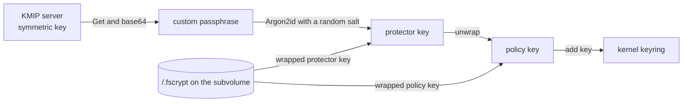
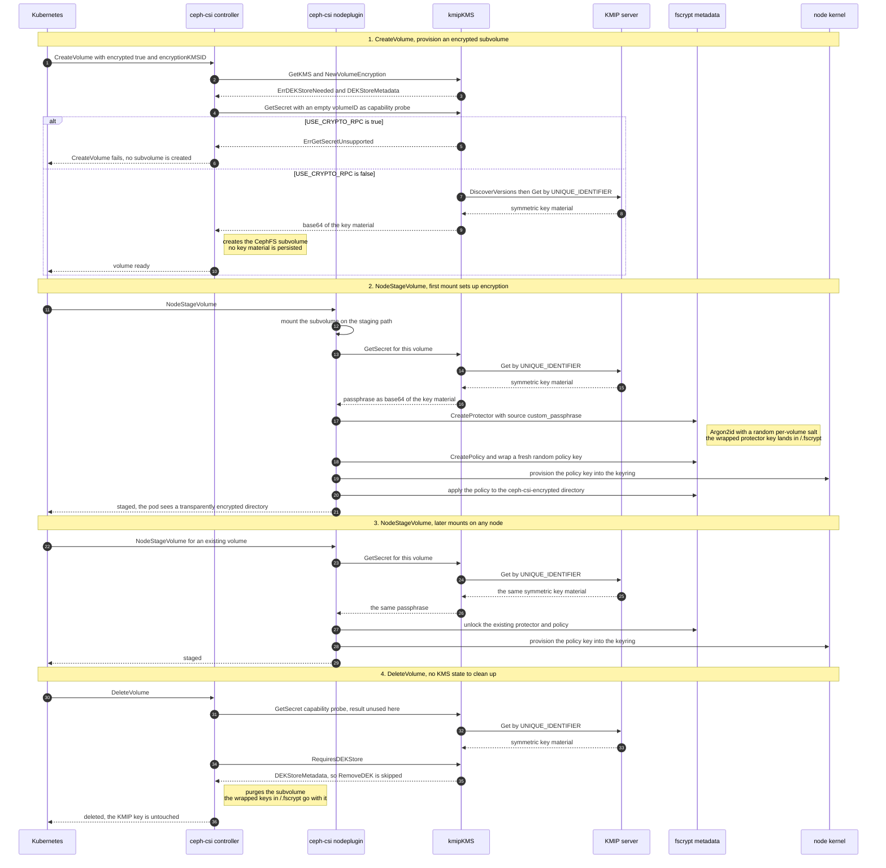
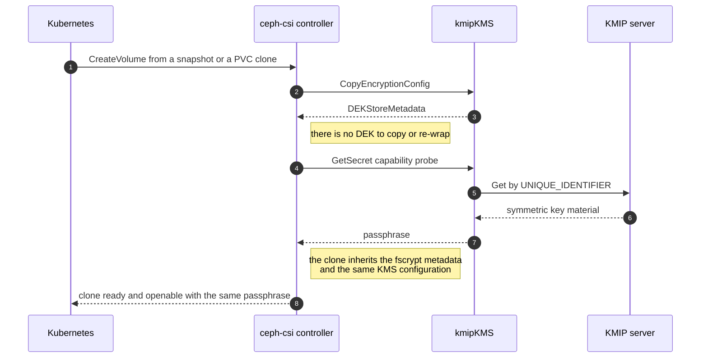
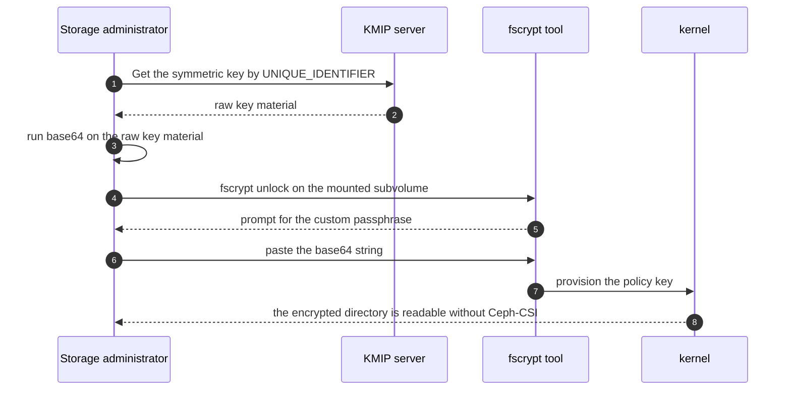
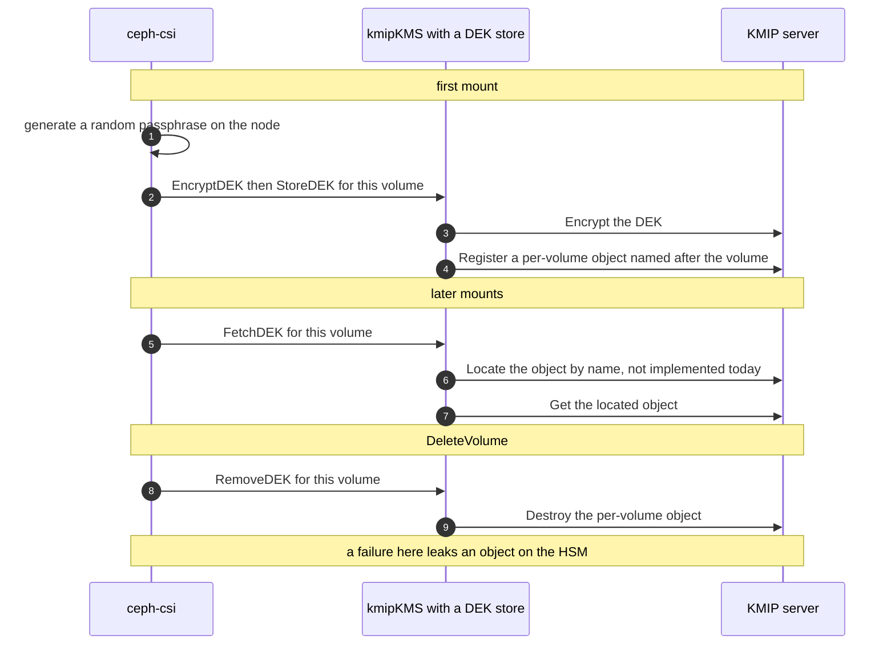

# fscrypt encryption with a KMIP key management system

## Problem description

As a Ceph-CSI user whose only key management option is a hardware security
module (HSM) that speaks the Key Management Interoperability Protocol
(KMIP), I want to use that HSM for CephFS file encryption. Ceph-CSI
supports KMIP for RBD block encryption today, but the same KMS can not
back CephFS encryption. Users are therefore forced to either drop CephFS
encryption or run HashiCorp Vault as a KMIP pass through.

The failure has a single cause. `ConfigureEncryption` probes the KMS with
`GetSecret` and refuses the configuration when the KMS answers
`ErrGetSecretUnsupported`:

```go
// internal/cephfs/store/volumeoptions.go
vo.Encryption, err = util.NewVolumeEncryption(kmsID, kms, nil)

if errors.Is(err, util.ErrDEKStoreNeeded) {
    // fscrypt uses secrets directly from the KMS.
    // Therefore we do not support an additional DEK
    // store. Since not all "metadata" KMS support
    // GetSecret, test for support here. Postpone any
    // other error handling
    _, err := vo.Encryption.KMS.GetSecret(ctx, "")
    if errors.Is(err, kmsapi.ErrGetSecretUnsupported) {
        return err
    }
}
```

`kmipKMS.GetSecret` is a stub that always answers exactly that error:

```go
// internal/kms/kmip.go
func (kms *kmipKMS) GetSecret(ctx context.Context, volumeID string) (string, error) {
    return "", ErrGetSecretUnsupported
}
```

So provisioning fails before a subvolume is created. The same probe guards
the RBD file encryption path in `configureFileEncryption`, which means
`encryptionType: file` on RBD is broken for KMIP in the same way.

This document proposes to implement `GetSecret` for the KMIP KMS, explains
why that single method is sufficient, and records the alternatives that
were considered and rejected.

## Background

### DEK store types in Ceph-CSI

Every KMS in Ceph-CSI declares where data encryption keys (DEK) live:

- `DEKStoreIntegrated` means the KMS stores the DEK itself. The KMS must
  also implement the `DEKStore` interface, because
  `NewVolumeEncryption` type asserts on it. Vault, Azure Key Vault and
  the Kubernetes Secrets KMS work this way.
- `DEKStoreMetadata` means Ceph-CSI has to store the DEK somewhere else.
  For RBD that place is the image metadata. KMIP, Amazon KMS and IBM Key
  Protect declare this type and use envelope encryption: a key encryption
  key (KEK) stays in the KMS and only wraps and unwraps the DEK.

`kmipKMS` is a `DEKStoreMetadata` KMS. It never needed `GetSecret`,
because `DecryptDEK` both fetches and applies the key in one step, either
with the KMIP `Decrypt` operation or by fetching the key with `Get` and
decrypting locally. Which of the two is used depends on the
`USE_CRYPTO_RPC` configuration option.

### What fscrypt needs from a KMS

fscrypt does not consume a DEK. It needs one stable secret that it can
use as a protector, and it derives and stores everything else itself:



Two properties of this picture decide the whole design.

First, **fscrypt is already the DEK store**. It writes a wrapped
protector key and a wrapped per-volume policy key into `/.fscrypt` on the
subvolume itself. There is no CephFS `DEKStore` implementation in
Ceph-CSI and none is needed. Every `DEKStore` in the tree serves either a
KMS that stores DEKs internally, an RBD image or an NVMe-oF volume. The
`cephfs-fscrypt.md` design document states the same principle: *"Since
fscrypt already stores wrapped keys there is no need for an extra layer
of wrapping."* A key hierarchy with wrapped per-volume keys therefore
already exists. The only piece missing is the outermost secret. See
*Is this envelope encryption* below for what that hierarchy does and does
not provide.

Second, **the secret has to be deterministic**. `fscrypt.Unlock` calls
`GetSecret` on every `NodeStageVolume`, including the very first one, and
never stores the result. A volume can only be reopened if the KMS returns
the same value again, on every node, for the lifetime of the volume.

Both consequences are visible in the existing code paths and require no
change:

| Path | Behavior for a `DEKStoreMetadata` KMS |
| --- | --- |
| `NewVolumeEncryption` | returns `ErrDEKStoreNeeded`, `dekStore` stays nil |
| `fscrypt.Unlock` | selects `SourceType_custom_passphrase` and calls `GetSecret` |
| `CopyEncryptionConfig` | skips the DEK copy, guarded on `DEKStoreIntegrated` |
| `cleanUpBackingVolume` | skips `RemoveDEK`, guarded on `DEKStoreIntegrated` |

Because every call site that would dereference the nil `dekStore` is
guarded on `DEKStoreIntegrated`, a `DEKStoreMetadata` KMS that implements
`GetSecret` needs no support outside of its own provider file.

### Is this envelope encryption

Structurally yes, and in the sense an HSM user usually means, no.

There is a key hierarchy with wrapped per-volume keys, and fscrypt is
what builds it:

| Level | Key | Stored |
| --- | --- | --- |
| root secret | base64 of the KMIP key, from `GetSecret` | on the KMIP server, fetched per mount |
| wrapping key | Argon2id over the root secret with a random salt | derived, never stored |
| protector key | 32 random bytes, per volume | wrapped, in `/.fscrypt/protectors` |
| policy key | random per volume, the actual data key | wrapped, in `/.fscrypt/policies` |
| per-file keys | derived by the kernel from the policy key | kernel keyring only |

fscrypt wraps with HKDF-SHA256 key stretching, AES-256-CTR and
HMAC-SHA256, so both stored blobs are authenticated. The KMIP key is
never the data key, and below the root secret no key material is shared
between volumes.

What this does not provide is the property an HSM user usually means by
envelope encryption: a KEK that never leaves the KMS. The key material is
exported to the node on every mount, and every wrap and unwrap runs
locally, in Ceph-CSI and in the kernel. In those terms the KMIP key is an
exported root secret rather than a KEK used in place.

The trade-off is deliberate and bounded:

- It is not weaker than what Ceph-CSI already ships. With
  `USE_CRYPTO_RPC` set to `false` the RBD path also fetches the key with
  `Get` and performs AES-GCM locally, and that is the mandatory
  configuration for GKLM.
- Genuine KMS side wrapping stays available where it is possible at all.
  With `USE_CRYPTO_RPC` set to `true`, RBD block encryption keeps using
  the KMIP `Encrypt` and `Decrypt` operations, and the gate described
  below is what keeps that configuration from being downgraded silently.
- No design can give fscrypt a KEK that stays in the HSM, because the
  policy key has to reach the kernel keyring of the node that serves the
  data.

### Why KMIP differs from Amazon KMS and IBM Key Protect

Amazon KMS and IBM Key Protect are `DEKStoreMetadata` providers that also
return `ErrGetSecretUnsupported`, and they can not be fixed the way this
document proposes. Their KEK can never be read out of the service. Their
API offers wrap and unwrap only.

KMIP is different. The `Get` operation returns the key material of a
managed symmetric key, and Ceph-CSI already relies on it: with
`USE_CRYPTO_RPC` set to `false` the KMIP provider fetches the key and
performs AES-GCM locally. That mode is not exotic. It is the mandatory
configuration for IBM Guardium Key Lifecycle Manager, as documented in
`encryption-with-gklm.md`.

fscrypt fundamentally requires key material in the kernel keyring of the
node. No design can keep the key inside the HSM and still use fscrypt.
KMIP is therefore the only envelope style KMS in the tree that can back
fscrypt at all, and it can do so only in `Get` mode.

## Proposed change

Implement `GetSecret` on `kmipKMS` as a base64 encoded copy of the
managed symmetric key, and reject the request when the KMS is configured
to keep cryptographic operations on the server:

```go
// GetSecret returns the key material of the KMIP managed symmetric key,
// for fscrypt to use as a custom passphrase. fscrypt derives its own
// per-volume keys from it and stores those, wrapped, on the volume.
//
// This requires the KMIP Get operation, which is only used when
// USE_CRYPTO_RPC is disabled. A KMIP server that keeps the key material
// to itself can not be used with fscrypt, because fscrypt needs the key
// in the kernel keyring of the node.
func (kms *kmipKMS) GetSecret(ctx context.Context, volumeID string) (string, error) {
    if kms.useCryptoRPC {
        return "", fmt.Errorf("%w: fscrypt requires the key material, set %q to false",
            ErrGetSecretUnsupported, kmipUseCryptoRPC)
    }

    key, err := kms.getKey(kms.uniqueIdentifier)
    if err != nil {
        return "", fmt.Errorf("failed to get key %q: %w", kms.uniqueIdentifier, err)
    }

    // fscrypt uses this as a passphrase. base64 keeps it printable and
    // lets an administrator reproduce it with base64(1) when unlocking a
    // volume with the fscrypt tool.
    return base64.StdEncoding.EncodeToString(key), nil
}
```

`getKey` already exists and is already used in production by
`encryptDEKUsingRemoteKey`. It validates that the returned object is a
symmetric key and that the key material is present. The change needs no
new KMIP operation, no new permission on the HSM, no new configuration
option and no change to any interface.

### Requiring USE_CRYPTO_RPC to be false

`USE_CRYPTO_RPC` selects between the KMIP `Encrypt` and `Decrypt`
operations and a local `Get` plus local AES-GCM. Setting it to `false`
already declares that key material may be fetched and used on the node,
which is exactly the precondition fscrypt imposes. Reusing the option
instead of adding a new one keeps the configuration surface unchanged.

Gating on it is deliberate:

- It fails fast. An unsupported combination is rejected during
  `CreateVolume` with an actionable message, instead of failing later
  during `NodeStageVolume` with an opaque KMIP result reason from an HSM
  that refuses `Get`.
- It answers the capability probe without a network round trip when the
  KMS runs in `Encrypt` and `Decrypt` mode.
- It does not silently contradict an administrator who deliberately
  configured the KMS to keep cryptographic operations on the server.

The cost is that a KMIP server supporting both modes needs a second
entry in the KMS configuration, with `USE_CRYPTO_RPC` set to `false`, to
serve fscrypt volumes. That is explicit and documented.

### Encoding the key material with base64

The metadata path feeds the secret to fscrypt as a
`SourceType_custom_passphrase`. Raw key material would work, because
`fscrypt.Unlock` sizes the key from the length of the passphrase and
Argon2id accepts arbitrary input. It is still the wrong choice.

The stated reason for using a custom passphrase rather than a raw key is
that a volume stays openable with the upstream `fscrypt` tool. That
requires a value a human can paste into a prompt, which raw AES key bytes
are not. `base64.StdEncoding` is chosen over `base64.URLEncoding` because
an administrator performing a manual recovery will run `base64` on the
key exported from the HSM and has to obtain exactly the string Ceph-CSI
used.

This encoding becomes part of the on-disk contract. The Argon2id
derivation is performed over these bytes, so changing the encoding after
the first release would make existing volumes permanently unopenable.
Because the combination of CephFS and KMIP can not be configured
successfully today, no volumes exist and the choice is free exactly once.

## Volume lifecycle

### Provisioning, mounting and deletion



Phase 4 shows the one wart of the design. The capability probe runs
whenever volume options are rebuilt from a volume ID, so `DeleteVolume`
spends a KMIP round trip on a value it does not use. This is accepted:
every call site of the probe ignores every error except
`ErrGetSecretUnsupported`, so a KMIP outage can not fail an operation
that would otherwise succeed. Caching would not help, because `GetKMS`
builds a fresh provider instance per request.

### Snapshots and clones



A clone of an encrypted subvolume carries its `/.fscrypt` directory with
it and refers to the same KMS configuration, so it unlocks with the same
passphrase. `CopyEncryptionConfig` has nothing else to do, exactly as for
the Kubernetes Secrets metadata KMS today.

### Manual recovery with the fscrypt tool



This is the property the `DEKStoreMetadata` path exists for, and the
reason the key material is base64 encoded rather than passed through raw.

## User visible change

### KMS configuration

No new options. An existing KMIP section becomes usable for CephFS as
soon as `USE_CRYPTO_RPC` is `false`:

```json
{
  "kmip-fscrypt": {
    "KMS_PROVIDER": "kmip",
    "KMS_SERVICE_NAME": "kmip-fscrypt",
    "USE_CRYPTO_RPC": "false",
    "KMIP_ENDPOINT": "kmip.example.com:5696",
    "KMIP_SECRET_NAME": "ceph-csi-kmip-credentials",
    "TLS_SERVER_NAME": "kmip.example.com",
    "READ_TIMEOUT": 10,
    "WRITE_TIMEOUT": 10
  }
}
```

### Storage class configuration

Unchanged from the other KMS providers:

```yaml
apiVersion: storage.k8s.io/v1
kind: StorageClass
metadata:
  name: csi-cephfs-sc-encrypted
provisioner: cephfs.csi.ceph.com
parameters:
  clusterID: <cluster-id>
  fsName: cephfs

  encrypted: "true"
  encryptionKMSID: "kmip-fscrypt"
```

### Prerequisites

1. A 256 bit symmetric key exists on the KMIP server and its UUID is
   provided as `UNIQUE_IDENTIFIER` in the credentials Secret.
1. The client certificate is allowed to perform the KMIP `Get` operation
   on that key.
1. `USE_CRYPTO_RPC` is set to `false` for the KMS configuration used by
   the storage class.
1. The provisioner Pod and every nodeplugin Pod can reach
   `KMIP_ENDPOINT` and read the credentials Secret. This is stricter than
   RBD block encryption, where only the node performs the unwrap.

The documentation in `cephfs/deploy.md` currently states that only KMS
that store secrets directly or expose a plain password work with fscrypt.
It has to be extended with KMIP in `Get` mode.

## Operational considerations

- **Rotating or destroying the key destroys data.** The protector is
  derived from the key material, and there is no re-wrap path. Rotating
  the key, re-keying the same UUID or pointing `UNIQUE_IDENTIFIER`
  somewhere else makes every existing fscrypt volume permanently
  unopenable. The hazard is identical to changing
  `encryptionPassphrase` for the Kubernetes Secrets metadata KMS, but it
  has to be stated explicitly for an HSM, where routine rotation is a
  normal expectation.
- **One passphrase per KMS configuration.** All volumes that use the same
  KMS configuration share the same fscrypt passphrase. fscrypt still
  derives a distinct policy key per volume, with a random per-protector
  salt, so no key material is reused across volumes. This matches the
  behavior of the Kubernetes Secrets metadata KMS. Tenants that must not
  share a passphrase need separate KMS configurations with separate keys.
- **One extra KMIP round trip** per `CreateVolume`, `DeleteVolume` and
  clone, caused by the capability probe, and one on top of the
  unavoidable fetch during `NodeStageVolume`.
- **HSM availability becomes a mount time dependency.** A volume can not
  be staged while the KMIP server is unreachable.

## Security considerations

The key material leaves the HSM and is held in Ceph-CSI memory on the
node, and the derived policy key is added to the node kernel keyring.
This is inherent to fscrypt rather than to this proposal: file level
encryption is performed by the kernel of the node that serves the data.
It is also not a new capability, because the same `Get` is already
performed for RBD volumes whenever `USE_CRYPTO_RPC` is `false`.

What this proposal does add is that the key material is used as a long
lived passphrase instead of only inside a single unwrap operation. The
consequences are bounded:

- fscrypt never writes the passphrase to disk. Only the Argon2id derived
  and wrapped protector key is persisted, in `/.fscrypt`.
- Compromise of the KMIP key exposes every volume under that
  configuration. That is already true of any envelope scheme where one
  KEK wraps every DEK.
- Deployments that require the key to never leave the HSM can not use
  fscrypt at all, with any design. For those, RBD block encryption with
  `USE_CRYPTO_RPC` set to `true` remains the correct choice, and the
  gate described above keeps that configuration from being weakened
  silently.

## Compatibility

- `RequiresDEKStore` keeps returning `DEKStoreMetadata`, and `EncryptDEK`
  and `DecryptDEK` are untouched, so existing RBD LUKS volumes backed by
  KMIP are unaffected.
- No configuration schema change, so no migration and no upgrade step.
- The only behavioral change is that a configuration that used to fail
  now succeeds. There is no downgrade concern for existing volumes,
  although a volume created by a newer release can not be staged by an
  older one.
- RBD with `encryptionType: file` gains KMIP support from the same
  change, because it uses the same probe and the same `fscrypt.Unlock`.

## Testing

Unit tests:

1. `GetSecret` returns an error matching `ErrGetSecretUnsupported` when
   `USE_CRYPTO_RPC` is enabled. This needs no KMIP server.
1. `GetSecret` returns the base64 of the key material in `Get` mode,
   exercised against an in-process KMIP server built from the
   `kmip.Server` and `OperationMux` types that are already vendored. This
   also covers `discover` and `getKey`, which have no functional test
   coverage today.

A KMIP test dummy must **not** be registered with
`RegisterTestProvider`. `TestGetPassphraseFromKMS` iterates the
registered dummies and calls `GetSecret` for real, so a KMIP dummy would
try to open a network connection during unit tests.

End to end tests are out of scope. There is no KMIP server in the end to
end environment, and CephFS encryption is covered there for the
Kubernetes Secrets metadata KMS and Vault only.

Manual verification:

1. Run a KMIP server, for example PyKMIP, and create a 256 bit symmetric
   key.
1. Create the credentials Secret and a KMS configuration with
   `USE_CRYPTO_RPC` set to `false`.
1. Provision an encrypted CephFS PVC, mount it, write data and confirm
   that `/.fscrypt` and the `ceph-csi-encrypted` directory exist on the
   subvolume root.
1. Delete and recreate the consuming Pod on another node to exercise the
   unlock path of an existing protector.
1. Repeat with `USE_CRYPTO_RPC` set to `true` and confirm that
   `CreateVolume` fails with a message naming the option.

## Alternatives considered

The issue that prompted this document offered two directions: implement
`GetSecret` and keep `DEKStoreMetadata`, or add a `DEKStoreIntegrated`
variant of the KMIP provider. It described the first as storing a wrapped
DEK in the volume metadata and unwrapping it through `DecryptDEK`. Those
are two different changes. Implementing `GetSecret` already yields a
wrapped per-volume data key, because fscrypt performs the wrapping,
although it does so on the node rather than in the KMS. Storing a wrapped
DEK in the volume metadata is a third option, larger than this one but
smaller than the integrated store, and the only one that keeps the key
material inside the KMS. Both alternatives now have their own design
documents, linked below.

### Deferred, KMIP as an integrated DEK store

Make `RequiresDEKStore` return `DEKStoreIntegrated` and implement
`StoreDEK`, `FetchDEK` and `RemoveDEK` against per-volume objects on the
HSM:



Its distinguishing capability is cryptographic erase of an individual
volume: destroying one object renders one volume unreadable while every
other volume keeps working. That is impossible with a single shared
secret. It is specified in full in [KMIP as an integrated DEK
store](kmip-integrated-dek-store.md), and is deferred rather than
rejected, because it can be added later as an additional provider without
disturbing any volume created under this design.

It is not the right first step:

- `Locate` is not part of the vendored `gemalto/kmip-go` payloads and has
  to be hand written as TTLV structures, the way `Encrypt` and `Decrypt`
  already are. The `Name` attribute and `Register` with
  `TemplateAttribute` *are* vendored, so naming is not the problem.
  Object state handling is: if a server refuses `Get` on a Pre-Active
  object, or `Destroy` without a preceding `Revoke`, then `Activate` and
  `Revoke` have to be hand written too.
- `Locate` by name is unavoidable, because `Register` returns a server
  assigned identifier and CephFS has nowhere to record it. That makes the
  least portable operation in KMIP load bearing on every mount, in a
  feature whose purpose is vendor neutrality.
- The HSM accumulates one object per volume and one more per clone, with
  licensing and quota implications on appliances that charge per key.
- Cleanup becomes best effort. `cleanUpBackingVolume` only logs a warning
  when `RemoveDEK` fails, so failures leak objects on the HSM
  permanently.
- `RequiresDEKStore` is a property of the provider, so flipping it would
  break every existing RBD KMIP user. It needs a separate provider
  identifier, which is what the deferred design specifies.
- It does not keep key material in the appliance. There is no KEK at all:
  per-volume keys are stored in the HSM and handed out on every mount.
  And because clones hold their own copy of the key material, erasing a
  volume does not erase its clones.

### Rejected, a wrapped DEK in the CephFS volume metadata

Keep `DEKStoreMetadata` and store a DEK wrapped by the KMIP key in CephFS
subvolume metadata, then unwrap it with `DecryptDEK`.

This is a stronger option than it appeared when this document was first
written, and it is now specified separately in [A metadata DEK store for
CephFS](cephfs-metadata-dek-store.md). Two corrections to the original
assessment:

- It does not need new storage infrastructure. CephFS subvolume and
  snapshot metadata are both implemented, in
  `internal/cephfs/core/metadata.go` and
  `internal/cephfs/core/snapshot_metadata.go`, and already carry the
  cluster name, client address, userID mapping and ServiceAccount
  restriction. What is missing is a thin `kms.DEKStore` adapter.
- It is the only one of the three designs under which the key material
  never leaves the key management system, and the only one that also
  fixes `aws-metadata`, `aws-sts-metadata` and `ibmkeyprotect`, whose CMK
  can never be exported and which therefore cannot be fixed by
  implementing `GetSecret` at all.

It remains a larger change than this one, it touches shared fscrypt code
rather than a single provider file, and it adds a dependency on a Ceph
version that supports subvolume metadata. The objection from
[cephfs-fscrypt.md](cephfs-fscrypt.md) that fscrypt already stores wrapped
keys still applies, but with a counter-argument: for a wrap and unwrap
only service, that extra layer is exactly what keeps the KEK inside the
service.

### Rejected, per-volume derivation with HKDF

Return `base64(HKDF-SHA256(key, info = "ceph-csi-fscrypt" + volumeID))`
instead of the key material. This is only a few lines more, is still
stateless and deterministic, and limits a leaked passphrase to a single
volume.

It was rejected as the default because it diverges from the Kubernetes
Secrets metadata KMS, which shares one passphrase across volumes, adds a
key derivation construction to review, and degrades manual recovery from
running `base64` to running an HKDF. The isolation gain is small, since
compromise of the KMIP key exposes everything under any of these designs.

This is the one alternative that has to be decided before the first
release, because it changes the passphrase that protects existing
volumes.

### Rejected, using the KMIP server as a pseudo random function

Derive the passphrase by calling the KMIP `Encrypt` operation over the
volume ID with a deterministic caller supplied initialization vector.
This is the only construction that would let fscrypt work with
`USE_CRYPTO_RPC` set to `true` and without per-volume storage.

It was rejected because deterministic AES-CBC used as a key derivation
function is a non standard construction, it depends on the server
honoring a caller supplied initialization vector, it has no
interoperability story with the `fscrypt` tool, and it is no better in
threat model terms than the proposed change, since the derived secret
still ends up on the node.

## References

- [A metadata DEK store for CephFS](cephfs-metadata-dek-store.md)
- [KMIP as an integrated DEK store](kmip-integrated-dek-store.md)
- [Ceph Filesystem fscrypt Support](cephfs-fscrypt.md)
- [Encrypted volumes with IBM GKLM](encryption-with-gklm.md)
- [Encrypted PVC](encrypted-pvc.md)
- [Issue 6324, add KMIP support to CephFS fscrypt encryption][issue-6324]
- [KMIP specification version 1.4][kmip-spec]
- [fscrypt kernel documentation][fscrypt-doc]
- [fscrypt user space tool](https://github.com/google/fscrypt)

[issue-6324]: https://github.com/ceph/ceph-csi/issues/6324
[kmip-spec]: https://docs.oasis-open.org/kmip/spec/v1.4/kmip-spec-v1.4.html
[fscrypt-doc]: https://www.kernel.org/doc/html/latest/filesystems/fscrypt.html
