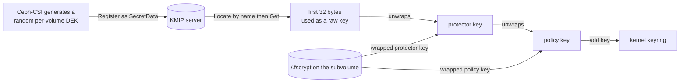
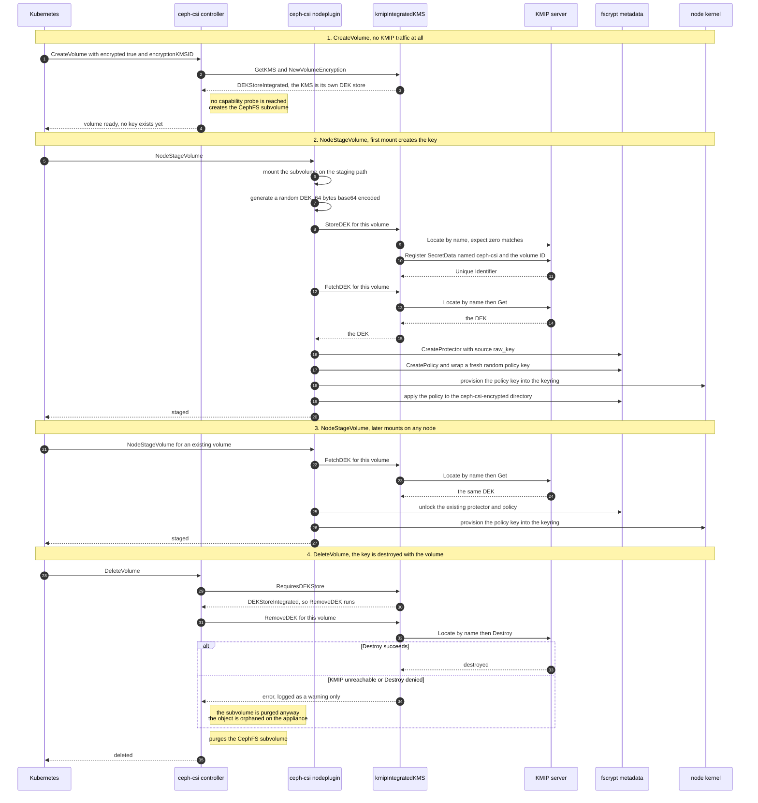
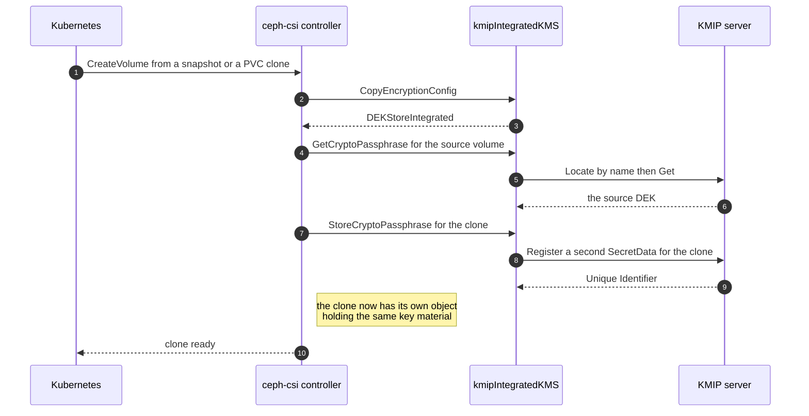
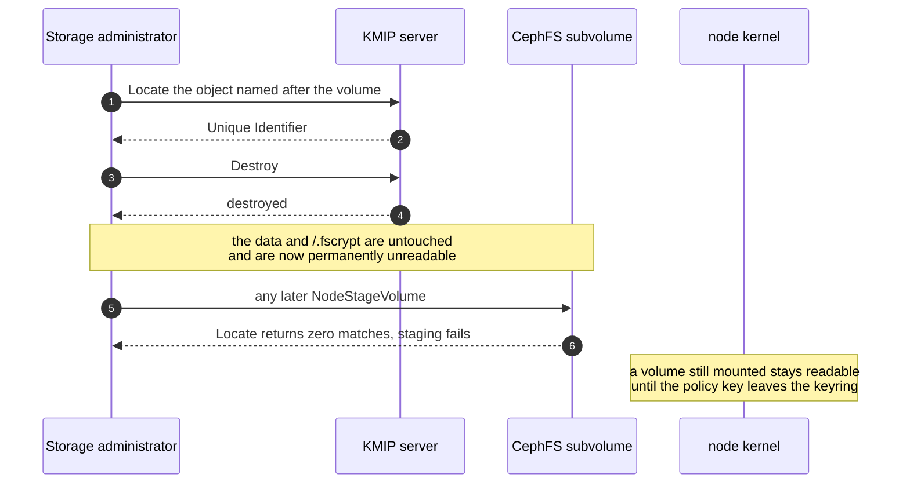

# KMIP as an integrated DEK store

## Problem description

Ceph-CSI can not use a KMIP key management system for CephFS file
encryption. The `kmipKMS` provider declares `DEKStoreMetadata` and
returns `ErrGetSecretUnsupported` from `GetSecret`, so
`ConfigureEncryption` rejects the configuration during `CreateVolume`.

Two directions can fix that. This document specifies the second one:
turn KMIP into a `DEKStoreIntegrated` provider, so that the KMIP server
holds one data encryption key (DEK) per volume, the way the Vault
integration already does.

The driver for this direction is not making fscrypt work. The
`GetSecret` direction is far cheaper for that. The driver is a capability
that only per-volume keys in the key management system can provide:
**cryptographic erase of a single volume**, plus per-volume access
control and audit records on the appliance.

## Relationship to the GetSecret proposal

The sibling document [fscrypt encryption with a KMIP key management
system](fscrypt-with-kmip.md) specifies the other direction. It keeps
`DEKStoreMetadata`, implements `GetSecret` as a base64 copy of the KMIP
managed key, and lets fscrypt build the key hierarchy on the volume. It
is roughly ten lines in one file.

The two designs are additive rather than exclusive. They register
different provider identifiers, they do not share on-disk state, and a
volume created under one is never read by the other. Shipping the
`GetSecret` change does not foreclose this design, and this design does
not obsolete it. A comparison table is at the end of this document.

## Background

### What DEKStoreIntegrated requires

`NewVolumeEncryption` treats the DEK store type as a contract:

```go
// internal/util/crypto.go
if ekms.RequiresDEKStore() == kms.DEKStoreIntegrated {
    dekStore, ok := ekms.(kms.DEKStore)
    if !ok {
        return nil, fmt.Errorf("KMS %T does not implement the "+
            "DEKStore interface", ekms)
    }

    ve.dekStore = dekStore

    return ve, nil
}

return ve, ErrDEKStoreNeeded
```

So an integrated provider must implement three methods keyed by volume
ID:

```go
type DEKStore interface {
    StoreDEK(ctx context.Context, volumeID string, dek string) error
    FetchDEK(ctx context.Context, volumeID string) (string, error)
    RemoveDEK(ctx context.Context, volumeID string) error
}
```

`vaultKMS` satisfies this trivially, because Vault is a key value store:
the volume ID becomes a path element under `vaultPassphrasePath`. KMIP
has no equivalent. It has managed objects addressed by a server assigned
Unique Identifier, and a `Name` attribute that clients may assign.

Note also that `NewVolumeEncryption` returns a nil error for an
integrated provider. The `GetSecret` capability probe in
`ConfigureEncryption` is therefore never reached, so this design performs
no KMIP request at all during `CreateVolume`.

### Why there is no place to record the object identifier

`Register` returns a server assigned Unique Identifier. The obvious
design would record it and use it in later `Get` calls. There is nowhere
to put it.

Recording it in volume metadata is possible. RBD image metadata would do,
and CephFS subvolume metadata is available too, in
`internal/cephfs/core/metadata.go`. But doing that defeats the purpose:
once a per-volume metadata store exists, the wrapped DEK can be kept there
directly and the KMIP server never has to hold per-volume objects at all.
That is a different design, specified in [A metadata DEK store for
CephFS](cephfs-metadata-dek-store.md), and it is strictly cheaper than
this one. A design that needs a per-volume store in order to use
per-volume KMS objects has argued itself out of existence.

Consequently this design has to find the object from the volume ID alone,
on every mount, which means `Locate` by `Name`. That single constraint
drives most of the cost and most of the risk below.

## Proposed change

### A separate provider identifier

Register a new provider `kmip-integrated` next to `kmip`, following the
pattern `aws-sts-metadata` already uses to sit next to `aws-metadata`:

```go
const kmsTypeKMIPIntegrated = "kmip-integrated"

var _ = RegisterProvider(Provider{
    UniqueID:    kmsTypeKMIPIntegrated,
    Initializer: initKMIPIntegratedKMS,
})

type kmipIntegratedKMS struct {
    kmipKMS
}

func (kms *kmipIntegratedKMS) RequiresDEKStore() DEKStoreType {
    return DEKStoreIntegrated
}
```

The connection and TLS handling in `initKMIPKMS` is factored into a
helper that returns `*kmipKMS`, and both initializers call it. Two
differences apply to the integrated variant:

- `UNIQUE_IDENTIFIER` becomes optional in the credentials Secret. The
  current code requires it, and this provider never uses it.
- `USE_CRYPTO_RPC` is ignored, for the reason in *No key encryption key
  is involved* below.

A distinct identifier is preferred over a configuration flag on the
existing provider. `RequiresDEKStore` decides where a volume's DEK lives,
and the `EncryptionKMS` documentation does permit it to vary by
configuration. But a flag means a single edited ConfigMap value silently
changes the storage location for every volume of that KMS, which is data
loss rather than a misconfiguration. Making it a provider name forces the
choice to be made once, visibly, per KMS section. Existing `kmip` users
are untouched by construction.

### The object stored on the KMIP server

One `SecretData` object per volume:

| Field | Value |
| --- | --- |
| Object Type | `SecretData` |
| Secret Data Type | `Password` |
| Key Format Type | `Opaque` |
| Key Material | the DEK bytes as produced by Ceph-CSI |
| Name | `ceph-csi:<volumeID>`, Name Type Uninterpreted Text String |

`SecretData` is chosen over `SymmetricKey`. The value Ceph-CSI stores is
the output of `generateNewEncryptionPassphrase`, which is base64 of 64
random bytes, an 88 character string. Registering that as a
`SymmetricKey` requires a Cryptographic Algorithm and Cryptographic
Length, and servers validate the length against the algorithm, so an 88
byte AES key is rejected. `SecretData` with type `Password` is the KMIP
object type for exactly this kind of value and carries no such
validation.

One consequence: the existing `getKey` helper rejects everything that is
not `ObjectTypeSymmetricKey`, so this design needs its own retrieval
helper reading `GetResponsePayload.SecretData` instead of reusing
`getKey`.

The name is prefixed with a constant `ceph-csi:` for legibility on the
appliance and to reduce the chance of collision with objects created by
other tenants of the same key management domain. No cluster identifier is
added, because a Ceph-CSI volume ID already embeds the Ceph cluster FSID.

### Finding the object for a volume

`FetchDEK` and `RemoveDEK` receive only the volume ID, so both start with
a `Locate` carrying a single `Name` attribute, then act on the returned
Unique Identifier. `Locate` is not part of the vendored
`gemalto/kmip-go` payloads and has to be written the way
`EncryptRequestPayload` and `DecryptRequestPayload` already are in
`kmip.go`:

```go
type LocateRequestPayload struct {
    MaximumItems int `ttlv:",omitempty"`
    Attribute    []kmip.Attribute
}

type LocateResponsePayload struct {
    LocatedItems     int `ttlv:",omitempty"`
    UniqueIdentifier []string
}
```

The helper resolving a volume ID to an identifier must treat anything
other than exactly one match as an error. Zero matches means the volume
has no DEK, which `FetchDEK` reports so that callers can distinguish it
from a transport failure. More than one match means the name is
ambiguous, which must fail loudly rather than pick one, because picking
the wrong object silently corrupts a volume.

### The DEK store methods

```text
StoreDEK(volumeID, dek)
    Register SecretData, TemplateAttribute.Name = ceph-csi:<volumeID>
    return error

FetchDEK(volumeID)
    Locate by Name -> exactly one Unique Identifier
    Get -> SecretData.KeyBlock.KeyValue.KeyMaterial
    return string(keyMaterial)

RemoveDEK(volumeID)
    Locate by Name -> exactly one Unique Identifier
    Destroy
    return error
```

`StoreDEK` should reject an attempt to register a name that already
exists, otherwise a retried `NodeStageVolume` can leave two objects with
the same name and make every later `Locate` ambiguous. That means a
`Locate` before the `Register`, which is one extra round trip on the
first mount only.

### No key encryption key is involved

For an integrated provider, `StoreCryptoPassphrase` calls `EncryptDEK`
and then `StoreDEK`. The `integratedDEK` helper in `kms.go` shows the
intended semantics: `EncryptDEK` and `DecryptDEK` return their input
unchanged, because the key management system protects the value itself.
This design follows that, which has three consequences worth stating
plainly:

- There is no KEK. The `UNIQUE_IDENTIFIER` managed key is not used, and
  neither the `Encrypt` and `Decrypt` operations nor local AES-GCM are
  performed. `USE_CRYPTO_RPC` has no meaning for this provider.
- This design is therefore **not** envelope encryption. It is direct key
  storage in the key management system, which is what
  `DEKStoreIntegrated` means throughout the tree and what the issue
  describes as its second option.
- The plaintext DEK still travels to the node on every mount and the
  derived policy key still enters the node kernel keyring. No design can
  avoid that, because fscrypt decrypts on the node that serves the data.

What the KMIP server provides is access-controlled, auditable and
individually destroyable storage of per-volume keys. It does not provide
a key that never leaves the appliance.

### Object state handling

A `Register` leaves the object in Pre-Active state. The happy path in
this design does not perform cryptographic operations on the object, only
`Get`, and `Destroy` of a Pre-Active object does not require a prior
`Revoke`. So the intended implementation never calls `Activate` and
never calls `Revoke`.

Whether that holds across appliances is the largest open question in this
design. Servers that refuse `Get` on a Pre-Active object, or that require
a `Revoke` before `Destroy` regardless of state, force two more hand
written operations. This is why the operation count below is given as a
range and not a number.

## KMIP operations

| Operation | Vendored payload | Needed |
| --- | --- | --- |
| `DiscoverVersions` | yes | yes, already used by `connect` |
| `Register` | yes, with `TemplateAttribute.Name` | yes |
| `Get` | yes, with `SecretData` in the response | yes |
| `Destroy` | yes | yes |
| `Locate` | no | yes, must be hand written |
| `Activate` | no | only if the server refuses Get on Pre-Active |
| `Revoke` | no | only if the server refuses Destroy on Pre-Active |

The client certificate needs `Register`, `Locate`, `Get` and `Destroy`
permission on the key management domain, against `Get` alone for the
sibling proposal. Several appliance policies grant client certificates
cryptographic operations without object creation and destruction, so this
raises the deployment bar for the users the original issue is about.

## Key management



fscrypt selects `SourceType_raw_key` for integrated providers, so the
Argon2id step used by the passphrase source is skipped and the DEK bytes
are used directly as the wrapping key. fscrypt requires exactly 32 bytes
for that source, while the stored DEK is an 88 character base64 string,
so only its first 32 bytes are used. That truncation is existing
behavior, fixed for Vault in commit `bdb5e9eb0`, and this design inherits
it unchanged rather than introducing a second convention.

## Volume lifecycle

### Provisioning, mounting and deletion



Phase 1 is cheaper than the sibling proposal, which spends a capability
probe round trip on `CreateVolume`. Phases 2 to 4 are more expensive, and
phase 4 carries the design's worst failure mode: `cleanUpBackingVolume`
logs a warning and continues when `RemoveDEK` fails, so a failed
`Destroy` leaves an object that no longer corresponds to any volume and
that nothing will ever clean up.

Making that failure fatal is worse, not better: it would block volume
deletion whenever the appliance is unreachable. The mitigation is the
deterministic naming scheme, which lets an operator list objects named
`ceph-csi:*` on the appliance, compare against the existing
PersistentVolumes and destroy the remainder. That procedure has to be
documented, and it is a real operational burden the sibling proposal does
not have.

### Snapshots and clones



`CopyEncryptionConfig` re-stores the source DEK under the clone's volume
ID, so each clone adds an object to the appliance holding the same key
material as its source. Object count therefore grows with clones and
snapshots, not only with PersistentVolumeClaims. On appliances that
license or cap object counts this is the main capacity consideration.

### Cryptographic erase of a single volume

This is the capability that justifies the design.



Two caveats belong in the documentation. A volume that is currently
staged remains readable until it is unstaged, because the policy key is
already in the node kernel keyring. And because clones hold their own
copies of the key material, erasing a volume does not erase its clones.

## What this buys

Against the sibling proposal, this design adds exactly three things:

1. **Per-volume cryptographic erase.** Destroying one object renders one
   volume permanently unreadable while leaving every other volume
   working. With a single shared secret this is impossible, because
   destroying it shreds every volume of that KMS configuration.
1. **Per-volume access control and audit.** Appliance policy and audit
   records apply per object, so retrieval can be traced and restricted
   per volume rather than per KMS configuration.
1. **No single secret whose disclosure exposes everything.** There is no
   root secret to leak.

What it does not add is protection against the threats usually cited for
an HSM, because every nodeplugin reads the KMIP credentials Secret from
its own Namespace and can therefore act on any object:

| Attacker has | GetSecret proposal | This design |
| --- | --- | --- |
| CephFS data and `/.fscrypt` only | safe | safe |
| the KMIP credentials Secret | all volumes | all volumes, via Locate |
| a compromised node while volumes are staged | the root secret, so all volumes | the staged DEKs, plus all volumes via the API |
| one-time exfiltration without ongoing credentials | all volumes, permanently | only the DEKs actually taken |

The last row is the only one where the designs genuinely differ.

## Risks and open questions

1. **Locate portability.** The KMIP specification says names "SHALL be
   unique within a given key management domain" and that a server "MAY
   specify rules by which the client creates valid names". Result
   counting, matching and attribute support in `Locate` vary between
   implementations. Building per-volume key retrieval on `Locate` by name
   is the least portable part of a feature whose purpose is vendor
   neutrality, and it needs validation against at least two appliances
   before merging.
1. **Object state semantics.** Whether `Get` works on a Pre-Active
   object, and whether `Destroy` needs a preceding `Revoke`, decides
   whether this design needs one new operation or three.
1. **Orphaned objects.** A failed `Destroy` leaks permanently and
   silently. Mitigated by naming and a documented audit procedure, not
   eliminated.
1. **Object growth.** One object per volume plus one per clone or
   snapshot, on appliances that often license by object count.
1. **Elevated permissions.** `Register` and `Destroy` are frequently
   withheld from client certificates that are allowed to perform
   cryptographic operations.
1. **Retry safety.** `NodeStageVolume` is retried by the kubelet. Without
   the `Locate` guard before `Register`, retries create duplicate names
   and every later lookup becomes ambiguous.
1. **Wider blast radius than fscrypt.** The provider is usable by RBD
   block encryption and by the NVMe-oF security key manager, both of
   which type assert `DEKStore` the same way. That is a feature, but it
   multiplies the object count and the review surface.

## Rejected variants within this design

- **Recording the Unique Identifier instead of using Locate.** CephFS
  subvolume metadata could hold it, but a design that needs a per-volume
  metadata store in order to use per-volume KMS objects should keep the
  wrapped DEK there instead and skip the KMS objects entirely. See
  [A metadata DEK store for CephFS](cephfs-metadata-dek-store.md).
- **Registering a SymmetricKey rather than SecretData.** Requires a
  valid algorithm and length pair, which the 88 character base64 DEK is
  not, and invites per-vendor validation failures.
- **Also wrapping the DEK with the `UNIQUE_IDENTIFIER` key before
  storing it.** Belt and braces with no threat it defends against: an
  attacker able to retrieve the object can also call `Decrypt`. It adds
  a second failure mode, where destroying the managed key silently
  bricks every stored DEK.
- **A configuration flag on the existing `kmip` provider instead of a
  new provider identifier.** One edited value would relocate every
  volume's DEK, turning a typo into data loss.
- **Creating the key on the appliance with `Create` instead of
  `Register`.** `Create` produces a symmetric key with server chosen
  material, which cannot carry the base64 DEK that fscrypt and the LUKS
  paths expect, and would need a different passphrase pipeline.

## Compatibility

- Existing `kmip` users are unaffected. The provider identifier is new,
  `RequiresDEKStore` on `kmipKMS` is unchanged, and no existing volume's
  DEK changes location.
- There is no migration between the two providers. A volume provisioned
  under `kmip` can not be read by `kmip-integrated` or the reverse,
  because the key lives in a different place. Switching the provider
  identifier of a KMS section that already has volumes makes them
  unopenable.
- The credentials Secret gains an optional field rather than a required
  one, so existing Secrets remain valid.

## Testing

The vendored `gemalto/kmip-go` includes `kmip.Server`, `OperationMux`,
`RegisterHandler`, `GetHandler` and `DestroyHandler`, so a complete
in-process KMIP server is available for unit tests. Only the `Locate`
handler has to be supplied through `ItemHandlerFunc`.

1. Round trip: `StoreDEK` then `FetchDEK` returns the same value, and
   `RemoveDEK` makes the following `FetchDEK` report a missing key.
1. `Locate` returning zero matches is distinguishable from a transport
   error.
1. `Locate` returning several matches fails rather than choosing one.
1. `StoreDEK` refuses to register a name that already exists.
1. The provider satisfies `kms.DEKStore` and reports
   `DEKStoreIntegrated`, so `NewVolumeEncryption` returns a nil error.
1. A test dummy must not be registered with `RegisterTestProvider`.
   `TestGetPassphraseFromKMS` iterates the registered dummies and would
   open network connections during unit tests.

End to end tests are out of scope: there is no KMIP server in the end to
end environment, and CephFS encryption is covered there only for the
Kubernetes Secrets metadata KMS and Vault. Manual verification against a
real appliance, and ideally a second one, is required because of the
`Locate` and object state questions above.

## Effort

Rough estimates, for comparison rather than for planning:

| Part | Production | Test |
| --- | --- | --- |
| provider registration and init refactor | 80 | 40 |
| `Locate` payloads and request helper | 60 | 60 |
| `Register`, `Get` and `Destroy` helpers | 120 | 60 |
| the three `DEKStore` methods | 60 | 90 |
| conditional `Activate` and `Revoke` | 80 | 40 |
| documentation | 200 | none |
| **total** | **about 600 lines** | **about 290 lines** |

## Comparison with the GetSecret proposal

| | GetSecret | Integrated DEK store |
| --- | --- | --- |
| production code | about 10 lines, one file | about 600 lines, several files |
| new KMIP operations | none | one to three, hand written |
| new provider identifier | no | yes, `kmip-integrated` |
| objects on the appliance | one, pre-existing | one per volume and per clone |
| appliance permissions | `Get` | `Register`, `Locate`, `Get`, `Destroy` |
| KMIP traffic on CreateVolume | one probe | none |
| KMIP traffic per mount | one `Get` | `Locate` plus `Get` |
| per-volume cryptographic erase | no | yes |
| per-volume audit and access control | no | yes |
| orphaned objects after a failed delete | not possible | possible and permanent |
| recovery with the `fscrypt` tool | paste the base64 key | needs a KMIP client to fetch the DEK |
| fscrypt source type | `custom_passphrase` | `raw_key` |
| vendor portability risk | low | medium to high, mainly `Locate` |
| unblocks RBD `encryptionType: file` | yes, same change | yes, with the new provider |

A third design, [A metadata DEK store for
CephFS](cephfs-metadata-dek-store.md), sits between the two at about 200
lines, needs no new KMIP protocol code, and is the only one of the three
under which the key material never leaves the appliance.

All three are legitimate answers to the issue, and the maintainers have
said either or both of the KMIP-specific ones are acceptable. The decision
rests on a single question: **is cryptographic erase of an individual
volume a requirement?** If it is, neither other design can provide it at
any size. If it is not, this design spends roughly three times the code of
the metadata store, and a materially larger operational and portability
risk, on a capability that is not needed — while not even delivering the
non-exportable key property that the metadata store does.

## References

- [fscrypt encryption with a KMIP key management system](fscrypt-with-kmip.md)
- [A metadata DEK store for CephFS](cephfs-metadata-dek-store.md)
- [Ceph Filesystem fscrypt Support](cephfs-fscrypt.md)
- [Encrypted volumes with IBM GKLM](encryption-with-gklm.md)
- [Encrypted PVC](encrypted-pvc.md)
- [Issue 6324, add KMIP support to CephFS fscrypt encryption][issue-6324]
- [KMIP specification version 1.4][kmip-spec]

[issue-6324]: https://github.com/ceph/ceph-csi/issues/6324
[kmip-spec]: https://docs.oasis-open.org/kmip/spec/v1.4/kmip-spec-v1.4.html
